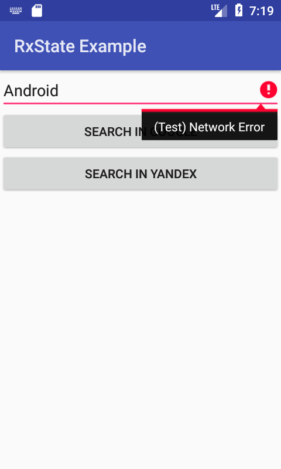

# RxState Example

Примеры реализации "undirectional архитектуры" по мотивам доклада https://youtu.be/0IKHxjkgop4

* [Реализация на RxJava + RxBinding](app/src/main/java/y2k/rxstateexample/MainActivity.kt)
* [Реализация на TheElmArchitecture](app/src/main/java/y2k/rxstateexample/ElmActivity.kt)

# Компонентная модель из ReactJS

### Синхронная реализация
- [Fragment.kt](app/src/main/java/y2k/rxstateexample/react/ExampleFragment.kt)
- [Component.kt](app/src/main/java/y2k/rxstateexample/react/ExampleComponent.kt)

### Асинхронная реализация на Kotlin-акторах
- [Fragment.kt](app/src/main/java/y2k/rxstateexample/actors/ExampleActorFragment.kt)
- [Component.kt](app/src/main/java/y2k/rxstateexample/actors/ExampleActorComponent.kt)

## Скриншоты

